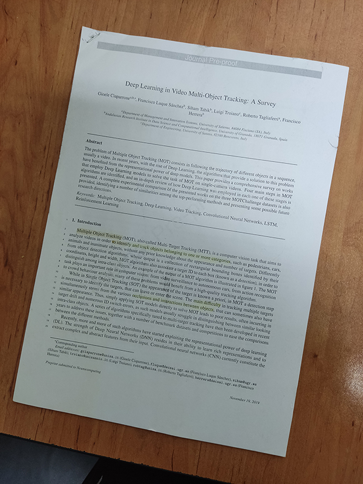

# Python Document Scanner

A multi-stage image processing pipeline built with Python and OpenCV that automatically detects, crops, and enhances documents from a photo — replicating the core functionality of apps like CamScanner.

Comes with three ways to run: a **web interface**, a **CLI script**, and a **Jupyter notebook**.

---

## About The Project

The goal is to take a photograph of a document shot at an angle and transform it into a clean, top-down, enhanced "scanned" image. The pipeline uses computer vision techniques to find the document's boundaries, correct its perspective, and improve readability.

### Key Features

- **Automatic Document Detection** — finds the largest quadrilateral contour in the image
- **Perspective Correction** — warps the detected region into a flat, top-down view
- **Image Enhancement** — gamma correction, CLAHE, saturation boost, and sharpening
- **Web Interface** — drag-and-drop UI with fullscreen preview and download
- **CLI Script** — run directly from the terminal with a single command

---

## Project Structure

```
Python-Document-Scanner-OpenCV/
├── app.py                  # Flask web server
├── run_scanner.py          # CLI entry point
├── scanner.py              # Core scanning pipeline
├── requirements.txt
├── images/                 # Input images
├── result images/          # Processed output images
├── templates/
│   └── index.html          # Web UI template
└── static/
    ├── style.css
    └── script.js
```

---

## The Processing Pipeline

Every scan — whether triggered from the web UI or CLI — runs through the same stages in `scanner.py`:

1. **Grayscale Conversion** — strips color since it isn't needed for edge detection
2. **Gaussian Blur** — smooths the image to reduce noise before edge detection
3. **Canny Edge Detection** — finds sharp intensity boundaries (document edges)
4. **Contour Detection** — finds all closed shapes, picks the largest 4-corner polygon as the document
5. **Perspective Transform** — uses `cv2.getPerspectiveTransform` + `cv2.warpPerspective` to flatten the document
6. **Enhancement**:
   - **Gamma Correction** — brightens mid-tones
   - **CLAHE** — adaptive histogram equalization on the LAB luminance channel
   - **Saturation & Sharpness Boost** — improves color vibrancy and text clarity

---

## Results

| Before | After |
| :----: | :---: |
|  |  |

---

## Getting Started

### Prerequisites

- Python 3.8+
- pip

### 1. Clone the repository

```bash
git clone https://github.com/arashnasresfahani/Python-Document-Scanner-OpenCV
cd Python-Document-Scanner-OpenCV
```

### 2. Install dependencies

```bash
pip install -r requirements.txt
```

---

## Option 1 — Web Interface (Recommended)

Launches a local web server with a drag-and-drop UI.

```bash
python app.py
```

Then open your browser at:

```
http://localhost:5000
```

**How to use:**
1. Drag and drop an image onto the upload area, or click to browse
2. Click **Process Document**
3. View the scanned result on the right panel
4. Click **Download** to save the output

Supported formats: JPG, PNG, WEBP, BMP, TIFF (max 10 MB)

---

## Option 2 — Command-Line Script

Run the scanner directly from the terminal without a browser.

**Using the built-in example image:**
```bash
python run_scanner.py
```

**Using your own image** (place it in the `images/` folder first):
```bash
python run_scanner.py your_image.jpg
```

**Expected output:**
- Input: `images/your_image.jpg`
- Output: `result images/Result_your_image.jpg`
- Terminal: `Wrote scanned image to ...\result images\Result_your_image.jpg`

---

## Option 3 — Jupyter Notebook

For an interactive, step-by-step walkthrough that shows intermediate results at each pipeline stage.

```bash
jupyter notebook
```

Open `doc_Scanner.ipynb` in your browser and run the cells.

---

## Dependencies

| Package | Purpose |
|---------|---------|
| `opencv-python` | Image processing and computer vision |
| `numpy` | Array operations |
| `flask` | Web server for the UI |
| `matplotlib` | Image display in the notebook |
| `notebook` | Jupyter notebook support |

Install all at once:

```bash
pip install -r requirements.txt
```
